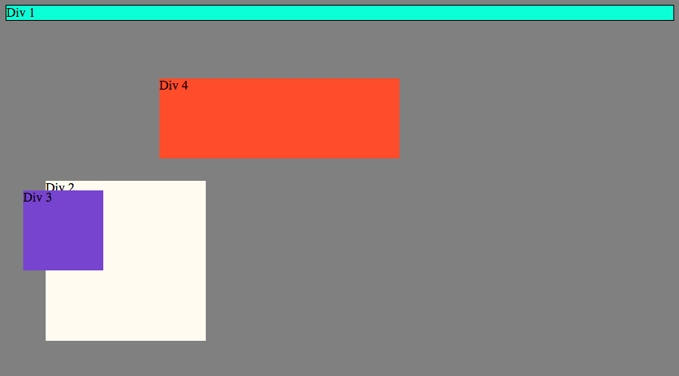
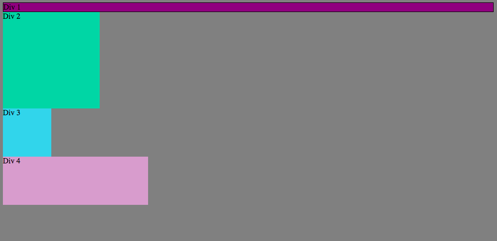
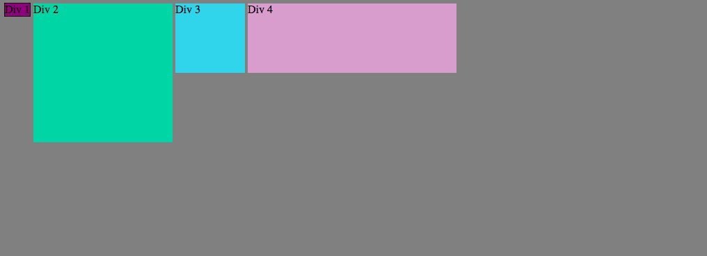
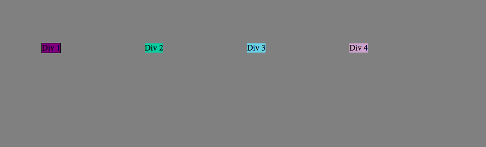
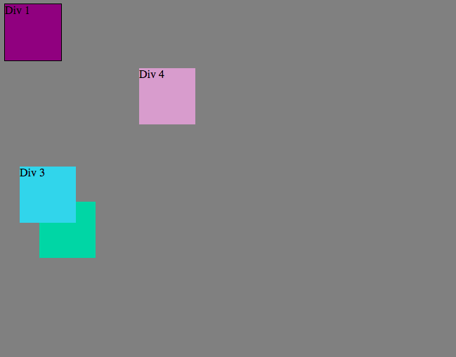
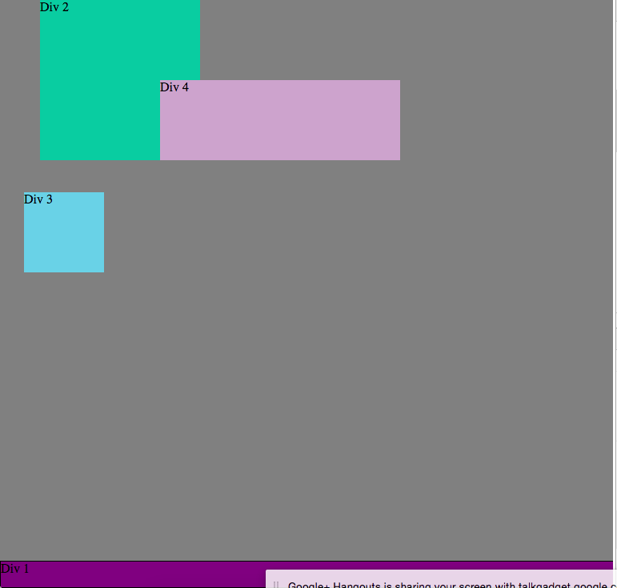
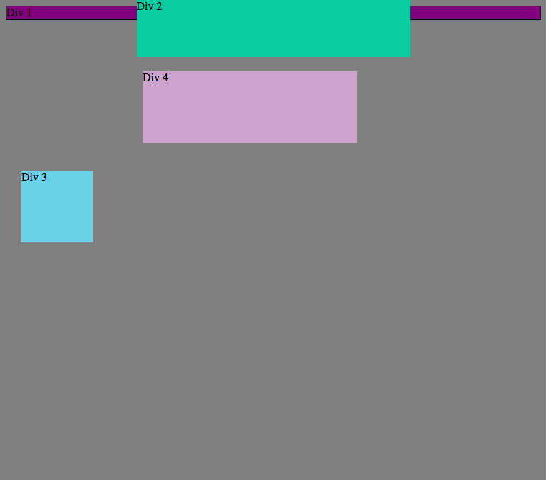
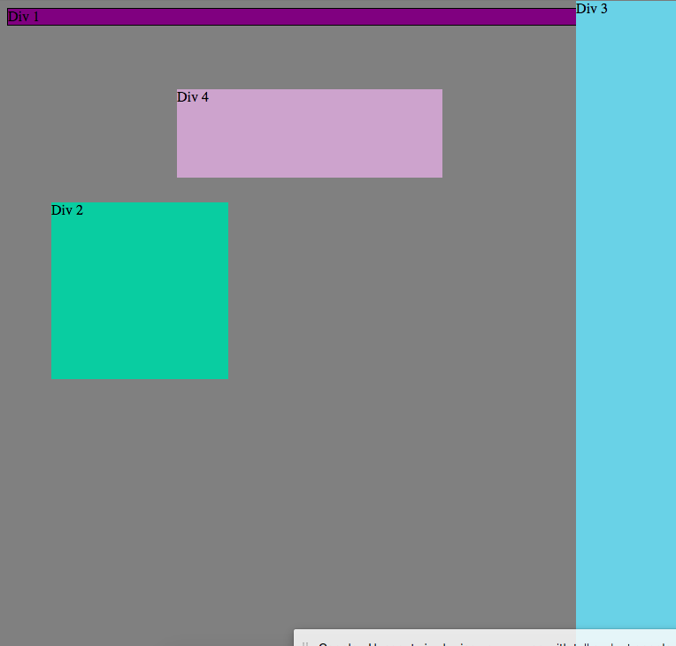
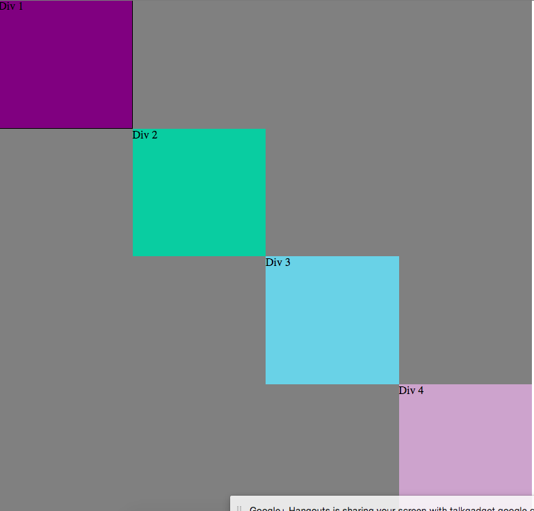

# 3.4 Chrome Dev Tools Reflection

> Changed the background-colors under ` element.style `

> Stacked the elements on top of each other

> Put the elements in a row with display inline and inline-block

> Put the elements in a row with a 5em margin

> Resized the elements to squares

> Made ` div-1 ` a footer

> Made ` div-2 ` a header

> Made ` div-3 ` a sidebar

> Got creative and placed them diagonally!

##How can you use Chrome's DevTools inspector to help you format or position elements?

Chrome's DevTools inspector helps you to format or position elements by allowing you to modify various declarations for the selectors associated with the elements. In doing this you are free to experiment with different ways to position your elements to better optimize your page layout.

## How can you resize elements on the DOM using CSS?

You can resize elements by going to the styles tab in the DOM, and changing the value of the height and width properties to a percentage or px value.

## What are the differences between Absolute, Fixed, Static, and Relative positioning? Which did you find easiest to use? Which was most difficult?

1. Absolute positioning: element is placed relative to the containing element (or parent element), and moves when you scroll.

2. Fixed positioning: element is placed relative to browser window, and doesn't move when you scroll.

3. Static positioning: normal flow, where elements are stacked on top of one another. Moves when you scroll.

4. Relative positioning: element is placed relative to where it would have been in normal flow, and moves when you scroll.

Easiest to use was definitely absolute positioning as it doesn't affect the surrounding elements, and most difficult was probably relative positioning is it can be quite tricky to predict where an element would have been placed in normal flow.

## What are the differences between Margin, Border, and Padding?

Border refers to the the edge of the element, that separates one element from another. Margin refers to the space outside of the border, between elements. Paddding refers to the space between the border, and the conent inside the element.

## What was your impression of this challenge overall? (love, hate, and why?)

My partner and I loved this challenge. We went in wondering what relevance this had to the rest of the challenges in this week (as my understanding of the DOM was more associated with JavaScript), and realized rather quickly that it is an amazing tool to use in modifying and quickly experimenting with CSS and layout organization.

