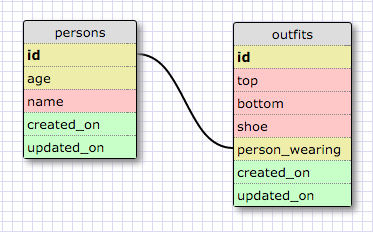

# Releasse 5: SELECTing data from a database

Select all data for all states.

` SELECT * FROM states; `

Select all data for all regions.

` SELECT * FROM regions; `

Select the state_name and population for all states.

` SELECT state_name, population FROM states; `

Select the state_name and population for all states ordered by population. The state with the highest population should be at the top.

` SELECT state_name, population FROM states ORDER BY population DESC; `

Select the state_name for the states in region 7.

` SELECT state_name FROM states WHERE region_id = 7; `

Select the state_name and population_density for states with a population density over 50 ordered from least to most dense.

` SELECT state_name, population_density FROM states WHERE population_density > 50 ORDER BY population_density ASC; `

Select the state_name for states with a population between 1 million and 1.5 million people.

` SELECT state_name FROM states WHERE population BETWEEN 1000000 AND 1500000; `

Select the state_name and region_id for states ordered by region in ascending order.

` SELECT state_name, region_id FROM states ORDER BY region_id ASC; `

Select the region_name for the regions with "Central" in the name.

` SELECT region_name FROM regions WHERE region_name LIKE '%Central%'; `

Select the region_name and the state_name for all states and regions in ascending order by region_id. Refer to the region by name. (This will involve joining the tables).

` SELECT regions.region_name, states.state_name FROM regions JOIN states ON regions.id = states.region_id; `

# Releasse 6: Your Own Schema

# Release 7: Reflect
## What are databases for?

Databases are used to store data and are made up of entities, attributes, and reltationships. Attributes are characteristics assigned to an entity.

## What is a one-to-many relationship?

A one-to-many relationship refers to the fact that an entity can have a relationship with another entity, wherein an instance in the first entity can be assigned several instances in the second entity. The cardinality between these entities would thus be one to many.

## What is a primary key? What is a foreign key? How can you determine which is which?

A primary key is a required attribute that is unique to each instance. A foreign key is an attribute helps define a relationship between entities; its value is the primary key from the first entity. Duplciates are allowed with foreign keys, as an instance in the primary entity may have several relationships with different instances in the second entity (one-to-many cardinality).

## How can you select information out of a SQL database? What are some general guidelines for that?

Selecting information out of a SQL database is rather intuitve. If you want a particular set of data associated with an attribute, you can just type ` SELECT attribute FROM entity; `. You can then select multiple attributes if needed by separating them by a comma like so: ` SELECT attribute_1, attribute_2 FROM entity; `.

