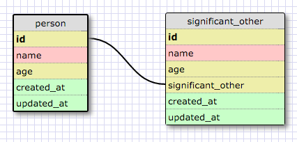
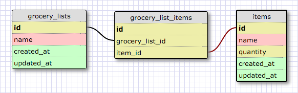

# Release 2: Create a One-to-one Schema

People and their significant others have a one to one relationship as (well, in monogamy at the very least) one person is associated with only one other person romantically. The significant other table also has the possibility of having empty fields, as not everyone has a significant other. One of the defining characteristics of one-to-one relationships is that a group of fields can optionally be empty (NULL).

# Release 4: Refactor

# Release 6: Reflect

## What is a one-to-one database?

A one-to-one database means that one instance of information is associated with only one other instance in another entity. A groups of fields in the associated entity however, can optionally be empty (NULL).

## When would you use a one-to-one database? (Think generally, not in terms of the example you created).

You would use a one-to-one database when dealing with information that has a relationship with only one other piece of information that is unique to that instance.

## What is a many-to-many database?

A many-to-many database means that multiple pieces (more than one instance) of information have relationships with multiple other pieces (more than once instance) of information.

## When would you use a many-to-many database? (Think generally, not in terms of the example you created).

You would use a many-to-many database when information that is associated with each other do not have a single unique instance that is connected to other instances or information. 

## What is confusing about database schemas? What makes sense?

The syntax (instances, entities) can be somewhat confusing at times when I'm not thinking of a specific example, however the ideas of how information are related to each other in a database makes sense.

